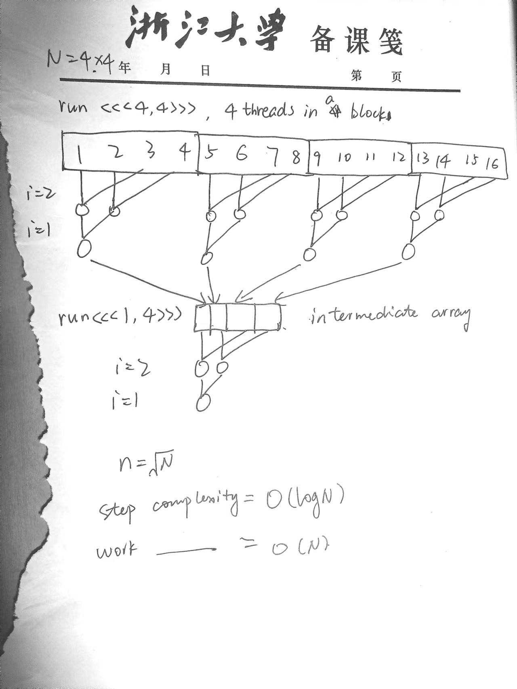

# learnGPGPU
Learning GPGPU computing via CUDA and SYCL. This repository works on parallel matrix multiplication (`matrice size == 1024 * 1024`) and sum reduction (`array size == 1024 * 1024`), and deploys the algorithms on both CUDA and SYCL. The time taken will be compared. To make the comparison fair and square, both the CUDA and SYCL implementation use the unified memory between CPU and GPU.
## Run the code
`bash builder.sh`
## Performance comparison
### Matrix multiplication
### Sum reduction
```
CPU operation, Time taken in ms: 3018
CUDA Naive, Time taken in ms: 1537
CUDA Shared, Time taken in ms: 1580
SYCL Naive, Time taken in ms: 1875
SYCL Shared, Time taken in ms: 99
```
## Matmul algorithm
## Reduction algorithm
### Serial
Trivial O(N)
```
    int sum = 0;
    for(int i = 0; i < N; ++i)
    {
        sum += arr[i];
    }
    *final = sum;
```
### Naive
Step Complexity = O(logN)
Work Complexity = O(N)

### Shared
Use a shared memory to copy the array elements assigned to each block. Everything else stays the same.