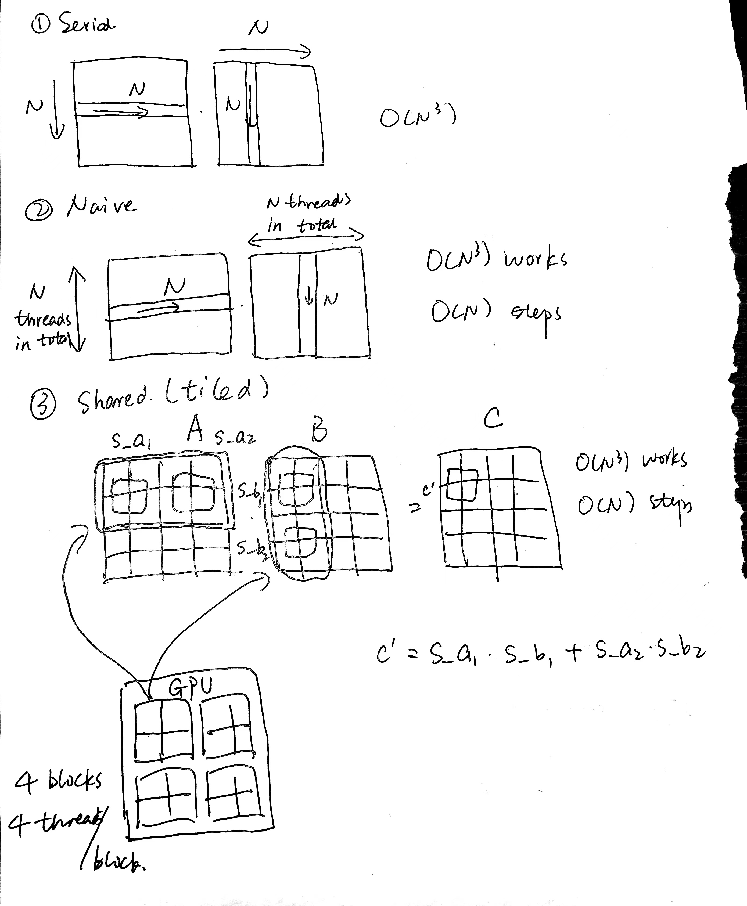
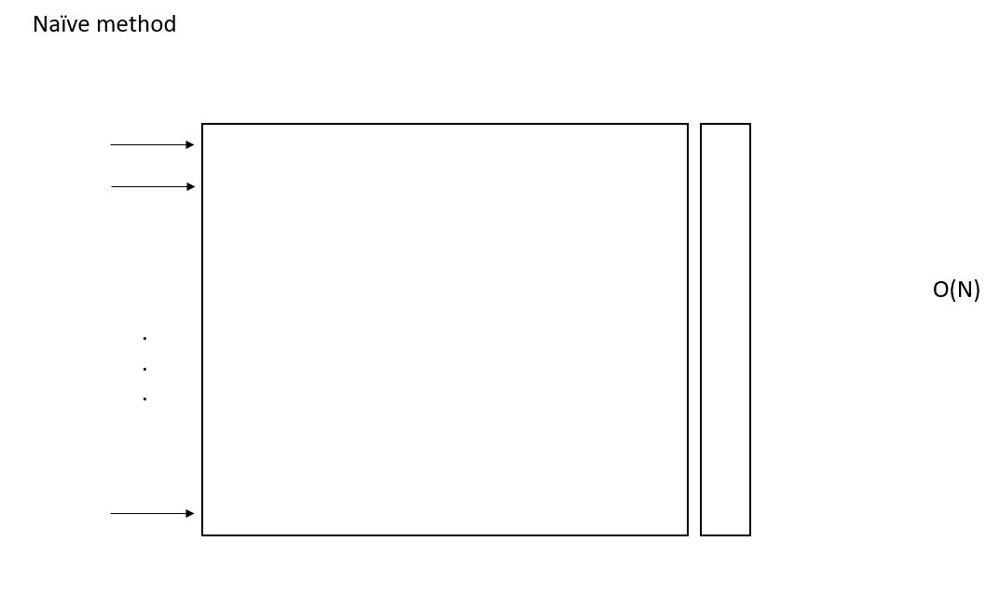
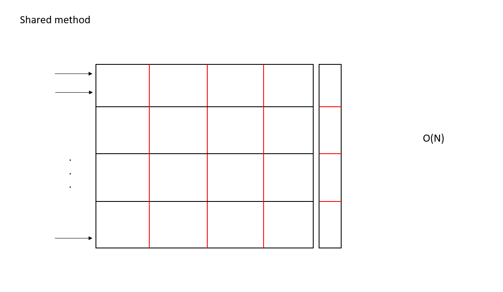

# learnGPGPU
Learning GPGPU computing via CUDA and SYCL. This repository works on parallel matrix multiplication, sum reduction and matrix transpose, and deploys the algorithms on both CUDA and SYCL. The time taken will be compared. To make the comparison fair and square, both the CUDA and SYCL implementation use the unified memory between CPU and GPU.
## Run the code
`bash builder.sh`
## Performance comparison
### Matrix multiplication
(`matrice size == 1024 * 1024`)
```
CPU operation, Time taken in ms: 6167371
CUDA Naive, Time taken in ms: 3895
CUDA Shared, Time taken in ms: 2015
SYCL Naive, Time taken in ms: 7566
SYCL Shared, Time taken in ms: 2287
```
### Sum reduction
(`array size == 1024 * 1024`)
```
CPU operation, Time taken in ms: 3018
CUDA Naive, Time taken in ms: 1537
CUDA Shared, Time taken in ms: 1580
SYCL Naive, Time taken in ms: 1875
SYCL Shared, Time taken in ms: 99
```
### Matrix transpose
(`matrice size == 10240 * 10240`)
```
CPU operation, Time taken in ms: 3099830
CUDA Naive, Time taken in ms: 142891
CUDA Shared, Time taken in ms: 23682
SYCL Naive, Time taken in ms: 159828
SYCL Shared, Time taken in ms: 21350
```
### Matrix Vector Multiplication
(`matrice size == 10240 * 10240`)
```
CPU operation, Time taken in ms: 50141 (O3 optimized)
Naive CUDA operation, Time taken in ms: 107584
Shared CUDA operation, Time taken in ms: 11149
Naive SYCL operation, Time taken in ms: 107863
Shared SYCL operation, Time taken in ms: 11615
```
### Scan
### Vector matrix multiplication

## Matmul algorithm

## Reduction algorithm
### Serial
Trivial O(N)
```
    int sum = 0;
    for(int i = 0; i < N; ++i)
    {
        sum += arr[i];
    }
    *final = sum;
```
### Naive
Step Complexity = O(logN)

Work Complexity = O(N)

### Shared
Use a shared memory to copy the array elements assigned to each block. Everything else stays the same.

## Matrix transpose
This is an implementation of https://developer.nvidia.com/blog/efficient-matrix-transpose-cuda-cc/


### Question 1
Why does he use a strided memory model in the first place? Is this purposed to show the speedup for shared memory?

## Matrix vector multiplication
In the shared memory method, the vector is broken down into several portions, each of which is to assigned to the GPU shared memory. The block dim is set to be 1D. Even though the rows of the matrix are accessed and computed in parallel, and the vector elements are accessed in series, the assignment of the shared memory can also make use of the parallel threads.


### Question 2
How come O3 optimized CPU operation can be faster than the naive CUDA approach?

## Inclusive Scan
Hillis & Steele Algorithm
### Question 3
How can CUDA speed surpass CPU speed?
```
CPU operation, Time taken in ms: 4569168
CUDA Naive, Time taken in ms: 6196287
Naive CUDA pass
```